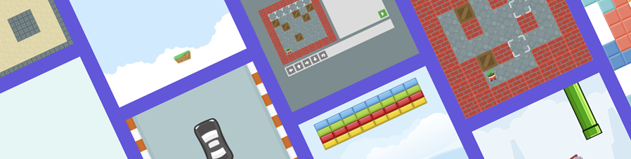

# Elpy.js - 2D JavaScript game engine.


[](https://github.com/space2pacman/elpy/blob/master/LICENSE.md)
[](https://en.wikipedia.org/wiki/JavaScript)
[](https://img.shields.io/bundlephobia/min/elpy?color=brightgreen&label=Size)
[](https://img.shields.io/npm/dt/elpy?label=Downloads)
[](https://www.npmjs.com/package/elpy)

| [Demo](https://space2pacman-misc.github.io/elpy-examples/docs/) | [Game examples](https://space2pacman-misc.github.io/elpy-examples/docs/examples.html) |
| :---: | :---: |

## Docs
- <a href="#install">Install</a>
- <a href="#basic-usage-example">Basic usage example</a>
- <a href="#engine">Engine</a>
  - <a href="#createname-x-y-width-height-options">create()</a>
  - <a href="#addobject">add()</a>
  - <a href="#keycallback">key()</a>
  - <a href="#keydowncallback">keydown()</a>
  - <a href="#keyupcallback">keyup()</a>
  - <a href="#mousemovecallback">mousemove()</a>
  - <a href="#clickcallback">click()</a>
  - <a href="#tickcallback">tick()</a>
  - <a href="#nexttickcallback">nextTick()</a>
  - <a href="#checkobjectinviewportobject">checkObjectInViewport()</a>
  - <a href="#fixingcameraobject-fixedcamera">fixingCamera()</a>
  - <a href="#unfixingcamera">unfixingCamera()</a>
  - <a href="#destroy">destroy()</a>
  - <a href="#onevent-callback">on()</a>
    - <a href="#event-load">Event `'load'`</a>
    - <a href="#event-animation">Event `'animation'`</a>
  - <a href="#load">load()</a>
- <a href="#engine-getters">Engine getters</a>
- <a href="#object">Object</a>
  - <a href="#runstep">run()</a>
  - <a href="#movex-y">move()</a>
  - <a href="#flydegrees-distance-step">fly()</a>
  - <a href="#jumpheight-multiplier-forced">jump()</a>
  - <a href="#fallmultiplier">fall()</a>
  - <a href="#pushobject">push()</a>
  - <a href="#rotatedegrees-x-y">rotate()</a>
  - <a href="#stop">stop()</a>
  - <a href="#destroy-1">destroy()</a>
  - <a href="#collisionobject">collision()</a>
  - <a href="#onevent-callback-1">on()</a>
    - <a href="#event-collision">Event `'collision'`</a>
    - <a href="#event-move">Event `'move'`</a>
    - <a href="#event-rotate">Event `'rotate'`</a>
    - <a href="#event-destroy">Event `'destroy'`</a>
    - <a href="#event-state">Event `'state'`</a>
    - <a href="#event-jump">Event `'jump'`</a>
    - <a href="#event-fall">Event `'fall'`</a>
    - <a href="#event-fly">Event `'fly'`</a>
    - <a href="#event-object">Event object</a>
  - <a href="#removecollisionobject">removeCollision()</a>
- <a href="#object-getters">Object getters</a>
- <a href="#object-setters">Object setters</a>
- <a href="#development">Development</a>
- <a href="#license">License</a>



## Install
#### Download
Latest builds are available in the project [releases page](https://github.com/space2pacman/elpy/releases/latest).
#### CDN
```js
https://unpkg.com/elpy/dist/elpy.min.js
```
#### NPM
```js
npm install elpy
```
## Basic usage example
```html
<!DOCTYPE html>
<html>
<head>
  <title>Elpy.js</title>
</head>
<body>
  <canvas id="field"></canvas>
  <script src="elpy.min.js"></script>
  <script>
    const elpy = new Elpy('#field', 500, 500);
    const player = elpy.create('player', 50, 50, 20, 20);
    const wall = elpy.create('wall', 100, 50, 20, 20, { color: 'brown' });

    elpy.add(player);
    elpy.add(wall);
    player.collision(wall);

    elpy.key(key => {
      if (key === 'ArrowUp') {
        player.move(player.x, player.y - 1);
      }
      if (key === 'ArrowDown') {
        player.move(player.x, player.y + 1);
      }
      if (key === 'ArrowLeft') {
        player.move(player.x - 1, player.y);
      }
      if (key === 'ArrowRight') {
        player.move(player.x + 1, player.y);
      }
    });
  </script>
</body>
</html>
```
## Engine
### Create engine instance
```js
const elpy = new Elpy(
  "#element", // id element canvas or HTML object element get by document.querySelector().
  500, // width.
  500, // height.
  // options.
  {
    preload, // default - true, enable / disable preloader.
    favicon // default - true, enable / disable favicon.
  }
)
```
---
### create(name, x, y, width, height, options)
| name | type | description |
| :---: | :---: | :--- |
| **`name`** | `<String>` | The object name must be unique. |
| **`x`** | `<Number>` | Position of the object along the x-axis. |
| **`y`** | `<Number>` | Position of the object along the y-axis. |
| **`width`** | `<Number>` | Object width in pixels. |
| **`height`** | `<Number>` | Object height in pixels. |
| **`options`** | `<Object>` | Additional object parameters. |

> Creates and returns an engine object.

<sub>_min example_</sub>
```js
const player = elpy.create('player', 10, 10, 20, 20);
```
<sub>_max example_</sub>
```js
const player = elpy.create('player', 10, 10, 20, 20, {
  obstacle: true, // default - true.
  pushing: false, // default - false.
  disabledEvents: false, // default - false.
  type: 'player object', // default - null.
  custom: {}, // default - null.
  color, // default - 'black'.
  // image: '' or image: { path: '', repeat: false }.
  image: { 
    path: '', // default - null.
    repeat: false // default - false.
  },
  // default - null.
  images: [
    {
      paths: ['images/player_left.png', 'images/player_right.png'], // path to image.
      state: 'move:left', // in what condition are the images available. player.state = 'move:left'.
      time: 100 // if player.animate = true - switching time between images.
    }
  ]
});
```
| name | type | description |
| :---: | :---: | :--- |
| **`obstacle`** | `<Boolean>` | To determine if an object is an obstacle if there is a collision with the object. If the object was not added to the collision then the object will pass through another object. If an object has been added to a collision, then by default the object will stop on collision. If it is necessary that the collision event occur and the object passes through the object, then the obstacle property can be switched to false. |
| **`pushing`** | `<Boolean>` | Will the object move if it is pushed through the push method. |
| **`disabledEvents`** | `<Boolean>` | Disables all events for an object. |
| **`type`** | `<Null>`, `<String>` | A simple string that allows you to add your own data. It is convenient to use to set the type of an object in order to distinguish them from each other later. |
| **`custom`** | `<Null>`, `<Object>` | An object where you can add your fields and use them via `object.options.custorm`. |
| **`color`** | `<String>` | Set object color. |
| **`image`** | `<String>`, `<Object>` | Set image. Two data types can be used: String or Object. <br>`image: 'path/to/image/'` <br>or for repeat image <br>`image: { path: 'path/to/image/', repeat: true }` |
| **`images`** | `<Array>` | Can be used if the object has several images that can be changed through the state. For example, the image of the position when the player goes to the right or left. You can also make animation of switching frames through the animate property (<a href="#object-getters">Object getters</a>). The switching `time` is set in the time property. |
---
### add(object)
| name | type |
| :---: | :---: |
| **`object`** | `<String>` |

> Add an object to the engine.

```js
elpy.add(player);
```
---
### key(callback)
| name | type |
| :---: | :---: |
| **`callback`** | `<Function>` |

> Listen for keydown and keyup events. Сallback is always called when a key is pressed.

```js
elpy.key(key => {
  if (key === 'ArrowUp') {
    // ...
  }
});
```
---
### keydown(callback)
| name | type |
| :---: | :---: |
| **`callback`** | `<Function>` |

> Сallback fires once on click.

```js
elpy.keydown(key => {
  if (key === 'ArrowUp') {
    // ...
  }
});
```
---
### keyup(callback)
| name | type |
| :---: | :---: |
| **`callback`** | `<Function>` |

> Сallback fires once on click.

```js
elpy.keyup(key => {
  if (key === 'ArrowUp') {
    // ...
  }
});
```
---
### mousemove(callback)
| name | type |
| :---: | :---: |
| **`callback`** | `<Function>` |

> Handles mouse movement on the canvas.

```js
elpy.mousemove((x, y) => {
  // x, y - coordinates inside the canvas.
});
```
---
### click(callback)
| name | type |
| :---: | :---: |
| **`callback`** | `<Function>` |

> Handles mouse click on the canvas.

```js
elpy.click((x, y) => {
  // x, y - coordinates inside the canvas.
});
```
---
### tick(callback)
| name | type |
| :---: | :---: |
| **`callback`** | `<Function>` |

> Called recursively. The next call is queued after the scene is updated (render). To cancel the call inside the callback, return false.

```js
let delta = 0;
// tick will be called 100 times.
elpy.tick(() => {
  if (delta === 100) {
    return false; // stop tick.
  }

  delta++;
  
  player.move(player.x + delta, player.y + delta);
});
```
---
### nextTick(callback)
| name | type |
| :---: | :---: |
| **`callback`** | `<Function>` |

> Adds a callback to the queue after the scene is updated (rendered) and calls callback once.

```js
elpy.nextTick(() => {
  // ...
});
```
---
### checkObjectInViewport(object)
| name | type |
| :---: | :---: |
| **`object`** | `<Object>` |

> Checking if the object is in the visible area.

```js
elpy.checkObjectInViewport(player); // returns true or false.
```
---
### fixingCamera(object, fixedCamera)
| name | type |
| :---: | :---: |
| **`object`** | `<Object>` |
| **`fixedCamera`** | `<Object>` |

> Fix the camera behind the object. You can fix both in one coordinate and in two.

<sub>_min example_</sub>
```js
elpy.fixingCamera(player, {
  x: true
});
```
<sub>_max example_</sub>
```js
elpy.fixingCamera(player, {
  x: true,
  y: true
});
```
---
### unfixingCamera()
> Unfix the camera from the one previously fixed behind the object.

```js
elpy.unfixingCamera();
```
---
### destroy()
> Destroying all objects and stopping rendering.

```js
elpy.destroy();
```
---
### on(event, callback)
| name | type |
| :---: | :---: |
| **`event`** | `<String>` |
| **`callback`** | `<Function>` |

> Listen to the engine event.

```js
elpy.on('eventName', () => {
  // Event handling.
});
```
#### Event: `'load'`
```js
elpy.on('load', () => {
  // Event handling.
});
```
#### Event: `'animation'`
```js
elpy.on('animation', (object, image, images) => {
  // object - object to be animated.
  // image - current image. Examlpe: 'images/player_left.png'.
  // images - a list of all images that were passed to paths when the object was created. Example: ['images/player_left.png', 'images/player_right.png'].
});
```
---
### load()
> The method is called automatically when `document.readyState === 'complete'`. If the engine has not loaded and is in a black window state, you can call load manually after all operations with the engine (creating objects, adding objects, etc.).

```js
elpy.load();
```
## Engine getters
<sub>_min example_</sub>
```js
elpy.width;
```
| name | type | description |
| :---: | :---: | :--- |
| width | `<Number>` | Returns the width of the canvas. |
| height | `<Number>` | Returns the height of the canvas. |
| offset | `<Object>` | Returns information on object and field offset. |
| objects | `<Object>` | Returns all added objects. |
## Object
### run(step)
| name | type | default |
| :---: | :---: | :---: |
| **`step`** | `<Number>` | `1` |

> Vector movement. Moves in different directions depending on positive or negative values.

<sub>_min example_</sub>
```js
player.run();
```
<sub>_max example_</sub>
```js
player.run(-1);
```
---
### move(x, y)
| name | type |
| :---: | :---: |
| **`x`** | `<Number>` |
| **`y`** | `<Number>` |

> Move at coordinates.

```js
player.move(10, 10);
```
---
### fly(degrees, distance, step)
| name | type | default |
| :---: | :---: | :---: |
| **`degrees`** | `<Number>` | `0` |
| **`distance`** | `<Number>` | `0` |
| **`step`** | `<Number>` | `1` |

> Vector flight.

<sub>_min example_</sub>
```js
player.fly(0);
```
<sub>_max example_</sub>
```js
player.fly(0, 100, 10);
```
---
### jump(height, multiplier, forced)
| name | type | default |
| :---: | :---: | :---: |
| **`height`** | `<Number>` | `0` |
| **`multiplier`** | `<Number>` | `0.1` |
| **`forced`** | `<Boolean>` | `false` |

<sub>_min example_</sub>
```js
player.jump(10);
```
<sub>_max example_</sub>
```js
player.jump(10, 0.5, true);
```
---
### fall(multiplier)
| name | type | default |
| :---: | :---: | :---: |
| **`multiplier`** | `<Number>` | `0.1` |

> Free fall.

<sub>_min example_</sub>
```js
player.fall();
```
<sub>_max example_</sub>
```js
player.fall(0.5);
```
---
### push(object)
| name | type |
| :---: | :---: |
| **`object`** | `<Object>` |

> Pushing an object. The one who pushes must have a collision with what he pushes.

```js
player.push(object);
```
---
### rotate(degrees, x, y)
| name | type | default |
| :---: | :---: | :---: |
| **`degrees`** | `<Number>` | `0` |
| **`x`** | `<Number>` | `0` |
| **`y`** | `<Number>` | `0` |

> Object rotation.

<sub>_min example_</sub>
```js
player.rotate(90);
```
<sub>_max example_</sub>
```js
player.rotote(90, 10, 20);
```
---
### stop()

> Stop: jump, fall, fly.

```js
player.stop();
```
---
### destroy()

> Destroy object.

```js
player.destroy();
```
---
### collision(object)
| name | type |
| :---: | :---: |
| **`object`** | `<Object>`, `<Array>` |

> Add collision object.

```js
player.collision(object);
```
---
### on(event, callback)
| name | type |
| :---: | :---: |
| **`event`** | `<String>` |
| **`callback`** | `<Function>` |

> Add an event listener.

```js
player.on('eventName', () => {
  // Event handling.
});
```
#### Event: `'collision'`
> Callback arguments.

| name | type |
| :---: | :---: |
| **`object`** | `<Object>` |
| **`side`** | `<String>` |

```js
player.on('collision', (object, side) => {
  // object - collision object.
  // side - side of the object that was collided.
});
```
#### Event: `'move'`
```js
player.on('move', () => {
  // Event handling.
});
```
#### Event: `'rotate'`
```js
player.on('rotate', () => {
  // Event handling.
});
```
#### Event: `'destroy'`
```js
player.on('destroy', () => {
  // Event handling.
});
```
#### Event: `'state'`
```js
player.on('state', () => {
  // Event handling.
});
```
#### Event: `'jump'`
> Callback arguments.

| name | type | description |
| :---: | :---: | :--: |
| **`event`** | `<Object>` | <a href="#event-object">link</a> |

```js
player.on('jump', event => {
  // event - event object.
});
```
#### Event: `'fall'`
> Callback arguments.

| name | type | description |
| :---: | :---: | :--: |
| **`event`** | `<Object>` | <a href="#event-object">link</a> |

```js
player.on('fall', event => {
  // event - event object.
});
```
#### Event: `'fly'`
> Callback arguments.

| name | type | description |
| :---: | :---: | :--: |
| **`event`** | `<Object>` | <a href="#event-object">link</a> |

```js
player.on('fly', event => {
  // event - event object.
});
```
#### Event object
> The object that is returned in the event callback: `jump`, `fall`, `fly`.

| name | type | description |
| :---: | :---: | :--- |
| `stopped` | `<Boolean>` | The property will be `true` if the object has been stopped. |
| `paused` | `<Boolean>` | The property will be `true` if the object has been paused. |
| `stop()` | | Stop object. If he was in a state: `jump`, `fall`, `fly`. |
| `pause()` | | Pause object. If he was in a state: `jump`, `fall`, `fly`. |
| `resume()` | | Resume object. If it was paused. |

```js
player.on('jump', event => {
  event.stopped; // returns true or false.
  event.paused; // returns true or false.
  event.stop();
  event.pause();
  event.resume();
});
```
---
### removeCollision(object)
| name | type |
| :---: | :---: |
| **`object`** | `<Object>` |

> Remove collision object from collision list.

```js
player.removeCollision(object);
```
## Object getters
<sub>_min example_</sub>
```js
player.name;
```
| name | type | description |
| :---: | :---: | :--- |
| name | `<String>` | Returns the name of the object. |
| options | `<Object>` | Returns object options. |
| track | `<Object>` | Returns the object's previous moves. |
| dest | `<Object>` | Returns the coordinates where the object is moving. |
| offset | `<Object>` | Returns the offset coordinates of an object. |
| isPushing | `<Boolean>` | Is it possible to push an object. |
| isJumping | `<Boolean>` | Is the object in a jump. |
| isFlying | `<Boolean>` | Is the object in fly. |
| isExist | `<Boolean>` | Does the object exist. |
| x | `<Number>` | Position of the object along the x-axis. |
| y | `<Number>` | Position of the object along the y-axis. |
| width | `<Number>` | Object width in pixels. |
| height | `<Number>` | Object height in pixels. |
| state | `<String>` | Returns the current state of the object. |
| animate | `<Boolean>` | Is the object animated. |
| ghost | `<Boolean>` | Whether collision is canceled with other objects that go to it. |
| degrees | `<Number>` | The degrees the object is rotated. |
| added | `<Boolean>` | Is the object added. |
## Object setters
<sub>_min example_</sub>
```js
player.width = 10;
```
| name | type | description |
| :---: | :---: | :--- |
| x | `<Number>` | Position of the object along the x-axis. |
| y | `<Number>` | Position of the object along the y-axis. |
| width | `<Number>` | Object width in pixels. |
| height | `<Number>` | Object height in pixels. |
| state | `<String>` | Used to switch textures. |
| animate | `<Boolean>` | Whether to animate the object. |
| ghost | `<Boolean>` | Cancels collision with other objects that go to it. |
| added | `<Boolean>` | Is the object added. |
## Development
```
npm run serve
```
## License
[MIT](https://github.com/space2pacman/elpy/blob/master/LICENSE.md)
